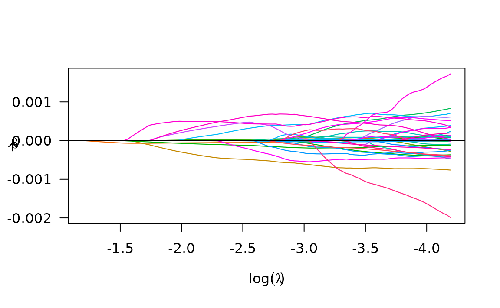
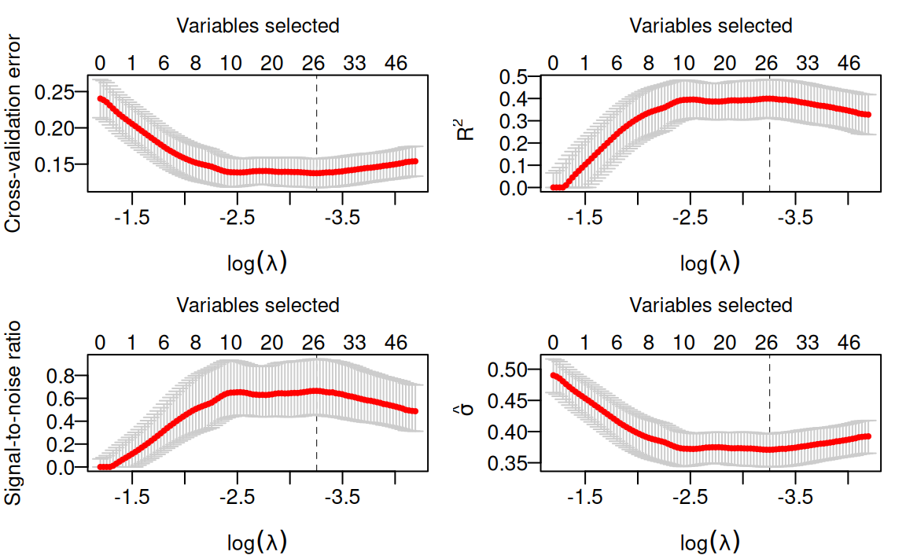
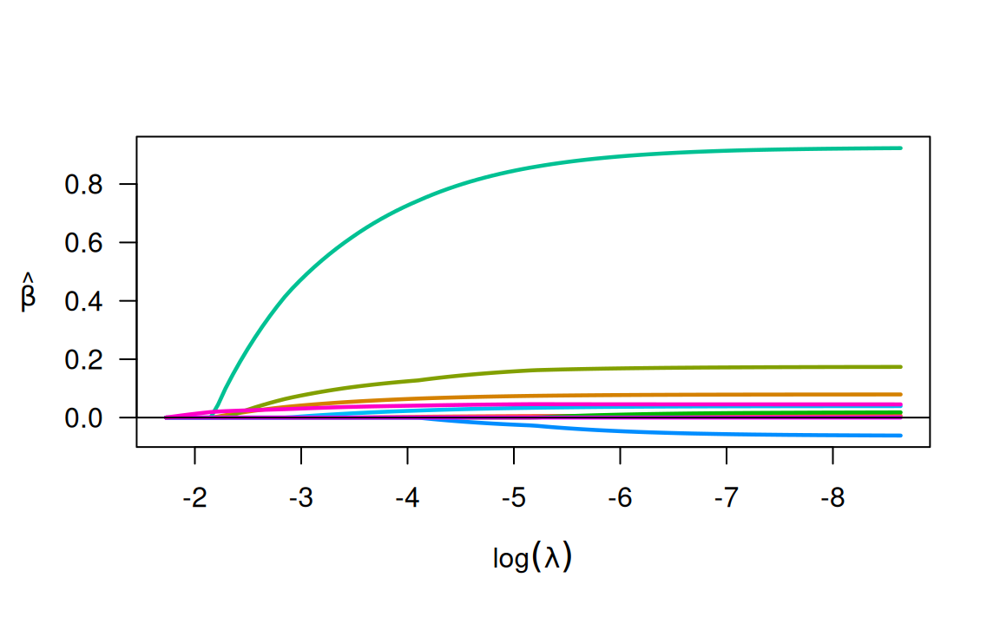
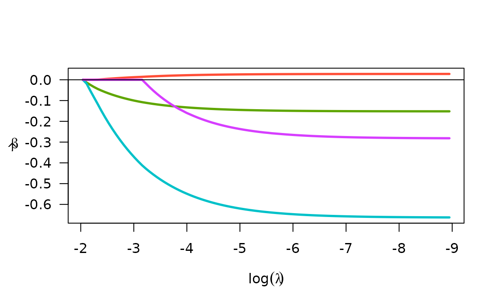
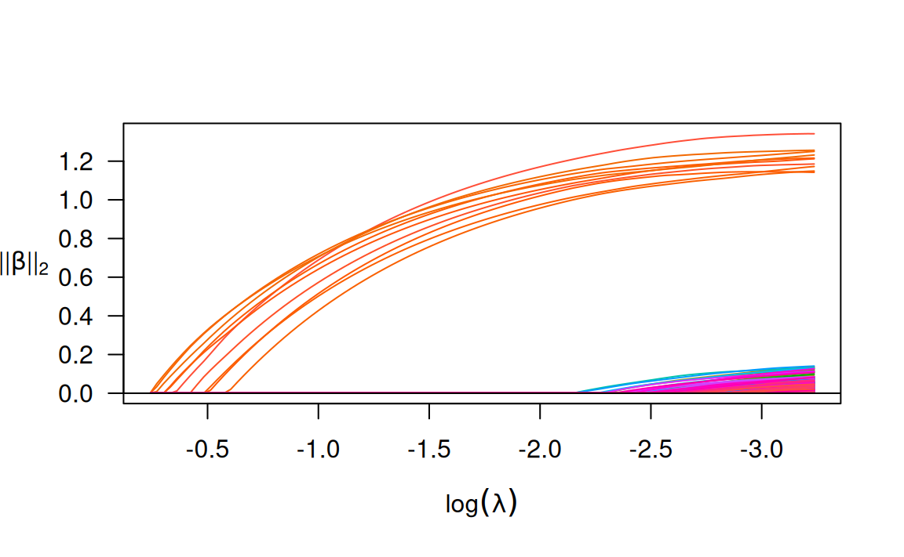
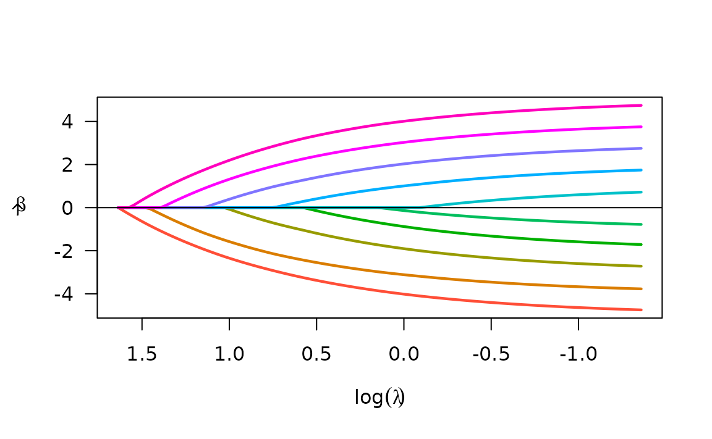
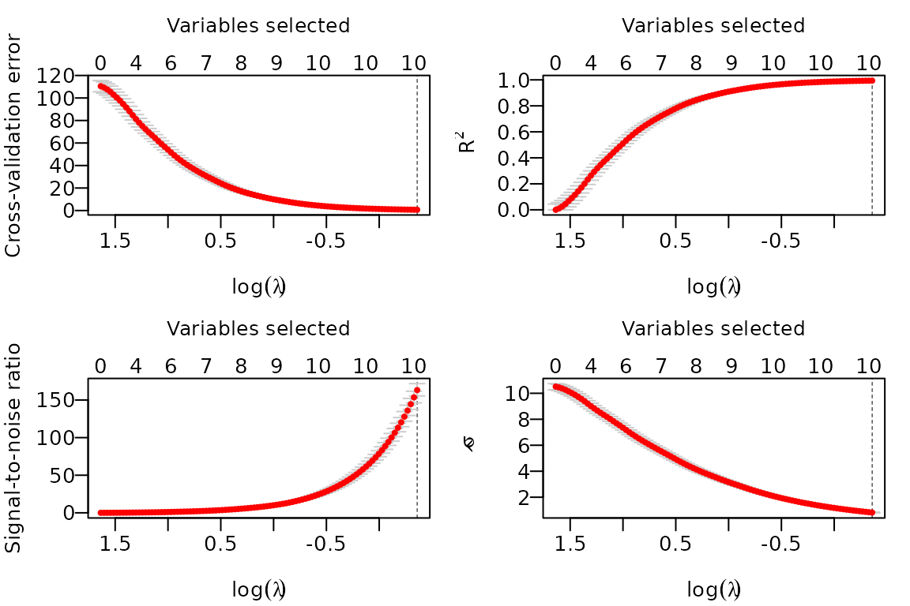

# biglasso

## Small Data

### Linear regression

``` r

library(biglasso)
#> Loading required package: bigmemory
#> Loading required package: Matrix
#> Loading required package: ncvreg

data(colon)
X <- colon$X
y <- colon$y
dim(X)
#> [1]   62 2000
```

``` r

X[1:5, 1:5]
#>   Hsa.3004 Hsa.13491 Hsa.13491.1 Hsa.37254 Hsa.541
#> t  8589.42   5468.24     4263.41   4064.94 1997.89
#> n  9164.25   6719.53     4883.45   3718.16 2015.22
#> t  3825.71   6970.36     5369.97   4705.65 1166.55
#> n  6246.45   7823.53     5955.84   3975.56 2002.61
#> t  3230.33   3694.45     3400.74   3463.59 2181.42
```

``` r

## convert X to a big.matrix object
## X.bm is a pointer to the data matrix
X.bm <- as.big.matrix(X)
str(X.bm)
#> Formal class 'big.matrix' [package "bigmemory"] with 1 slot
#>   ..@ address:<pointer: 0x55e7c8fe2f60>
```

``` r

dim(X.bm)
#> [1]   62 2000
```

``` r

X.bm[1:5, 1:5]
#>   Hsa.3004 Hsa.13491 Hsa.13491.1 Hsa.37254 Hsa.541
#> t  8589.42   5468.24     4263.41   4064.94 1997.89
#> n  9164.25   6719.53     4883.45   3718.16 2015.22
#> t  3825.71   6970.36     5369.97   4705.65 1166.55
#> n  6246.45   7823.53     5955.84   3975.56 2002.61
#> t  3230.33   3694.45     3400.74   3463.59 2181.42
## same results as X[1:5, 1:5]
```

``` r

## fit entire solution path, using our newly proposed "Adaptive" screening rule (default)
fit <- biglasso(X.bm, y)
plot(fit)
```



### Cross-Validation

``` r

## 10-fold cross-valiation in parallel
cvfit <- tryCatch(
         {
                cv.biglasso(X.bm, y, seed = 1234, nfolds = 10, ncores = 4)
         },
         error = function(cond) {
                cv.biglasso(X.bm, y, seed = 1234, nfolds = 10, ncores = 2)
         }
)
```

After cross-validation, a few things we can do:

- plot the cross-validation plots:

``` r

par(mfrow = c(2, 2), mar = c(3.5, 3.5, 3, 1) ,mgp = c(2.5, 0.5, 0))
plot(cvfit, type = "all")
```



- Summarize CV object:

``` r

summary(cvfit)
#> lasso-penalized linear regression with n=62, p=2000
#> At minimum cross-validation error (lambda=0.0386):
#> -------------------------------------------------
#>   Nonzero coefficients: 27
#>   Cross-validation error (deviance): 0.14
#>   R-squared: 0.40
#>   Signal-to-noise ratio: 0.66
#>   Scale estimate (sigma): 0.371
```

- Extract non-zero coefficients at the optimal $`\lambda`$ value:

``` r

coef(cvfit)[which(coef(cvfit) != 0),]
#>   (Intercept)      Hsa.8147     Hsa.43279     Hsa.36689      Hsa.3152 
#>  6.882526e-01 -5.704059e-07 -2.748858e-08 -6.967419e-04  4.940698e-05 
#>     Hsa.36665     Hsa.692.2      Hsa.1272       Hsa.166     Hsa.31801 
#>  1.297733e-05 -1.878545e-04 -1.808689e-04  3.717512e-04  1.119437e-04 
#>      Hsa.3648      Hsa.1047     Hsa.13628      Hsa.3016      Hsa.5392 
#>  1.508691e-04  6.557284e-07  6.519466e-05  2.479566e-05  5.741251e-04 
#>      Hsa.1832      Hsa.1464     Hsa.12241     Hsa.44244      Hsa.9246 
#> -4.052627e-05  1.821951e-05 -1.912212e-04 -3.369856e-04 -1.582765e-06 
#>     Hsa.41159     Hsa.33268      Hsa.6814      Hsa.1660       Hsa.404 
#>  3.974870e-04 -4.911208e-04  5.639023e-04  5.171245e-04 -5.208537e-05 
#>     Hsa.43331      Hsa.1491   Hsa.41098.1 
#> -6.853944e-04  2.977285e-04 -1.748628e-04
```

### Logistic Regression

``` r

data(Heart)
X <- Heart$X
y <- Heart$y
X.bm <- as.big.matrix(X)
fit <- biglasso(X.bm, y, family = "binomial")
plot(fit)
```



### Cox Regression

``` r

library(survival)
#> 
#> Attaching package: 'survival'
#> The following object is masked _by_ '.GlobalEnv':
#> 
#>     colon
X <- heart[,4:7]
y <- Surv(heart$stop - heart$start, heart$event)
X.bm <- as.big.matrix(X)
#> Warning in as.big.matrix(X): Coercing data.frame to matrix via factor level
#> numberings.
fit <- biglasso(X.bm, y, family = "cox")
plot(fit)
```



### Multiple response Linear Regression (multi-task learning)

``` r

set.seed(10101)
n=300; p=300; m=5; s=10; b=1
x = matrix(rnorm(n * p), n, p)
beta = matrix(seq(from=-b,to=b,length.out=s*m),s,m)
y = x[,1:s] %*% beta + matrix(rnorm(n*m,0,1),n,m)
x.bm = as.big.matrix(x)
fit = biglasso(x.bm, y, family = "mgaussian")
plot(fit)
```



## Big Data

When the raw data file is very large, it’s better to convert the raw
data file into a file-backed `big.matrix` by using a file cache. We can
call function `setupX`, which reads the raw data file and creates a
backing file (.bin) and a descriptor file (.desc) for the raw data
matrix:

``` r

## The data has 200 observations, 600 features, and 10 non-zero coefficients.
## This is not actually very big, but vignettes in R are supposed to render
## quickly. Much larger data can be handled in the same way.
if(!file.exists('BigX.bin')) {
  X <- matrix(rnorm(1000 * 5000), 1000, 5000)
  beta <- c(-5:5)
  y <- as.numeric(X[,1:11] %*% beta)
  write.csv(X, "BigX.csv", row.names = F)
  write.csv(y, "y.csv", row.names = F)
  ## Pretend that the data in "BigX.csv" is too large to fit into memory
  X.bm <- setupX("BigX.csv", header = T)
}
#> Reading data from file, and creating file-backed big.matrix...
#> This should take a while if the data is very large...
#> Start time:  2026-05-06 15:55:30 
#> End time:  2026-05-06 15:55:31 
#> DONE!
#> 
#> Note: This function needs to be called only one time to create two backing
#>       files (.bin, .desc) in current dir. Once done, the data can be
#>       'loaded' using function 'attach.big.matrix'. See details in doc.
```

It’s important to note that the above operation is just one-time
execution. Once done, the data can always be retrieved seamlessly by
attaching its descriptor file (.desc) in any new R session:

``` r

rm(list = c("X", "X.bm", "y")) # Pretend starting a new session
X.bm <- attach.big.matrix("BigX.desc")
y <- read.csv("y.csv")[,1]
```

This is very appealing for big data analysis in that we don’t need to
“read” the raw data again in a R session, which would be very
time-consuming. The code below again fits a lasso-penalized linear
model, and runs 10-fold cross-validation:

``` r

system.time({fit <- biglasso(X.bm, y)})
#>    user  system elapsed 
#>   0.275   0.000   0.275
```

``` r

plot(fit)
```



``` r

# 10-fold cross validation in parallel
tryCatch(
    {
        system.time({cvfit <- cv.biglasso(X.bm, y, seed = 1234, ncores = 4, nfolds = 10)})
    },
    error = function(cond) {
        system.time({cvfit <- cv.biglasso(X.bm, y, seed = 1234, ncores = 2, nfolds = 10)})
    }
)
#>    user  system elapsed 
#>   0.374   0.010   3.025
```

``` r

par(mfrow = c(2, 2), mar = c(3.5, 3.5, 3, 1), mgp = c(2.5, 0.5, 0))
plot(cvfit, type = "all")
```



## Links

- [biglasso on CRAN](https://cran.r-project.org/package=biglasso)
- [biglasso on GitHub](https://github.com/pbreheny/biglasso)
- [biglasso website](https://pbreheny.github.io/biglasso/index.html)
- [big.matrix
  manipulation](https://cran.r-project.org/package=bigmemory/index.html)
