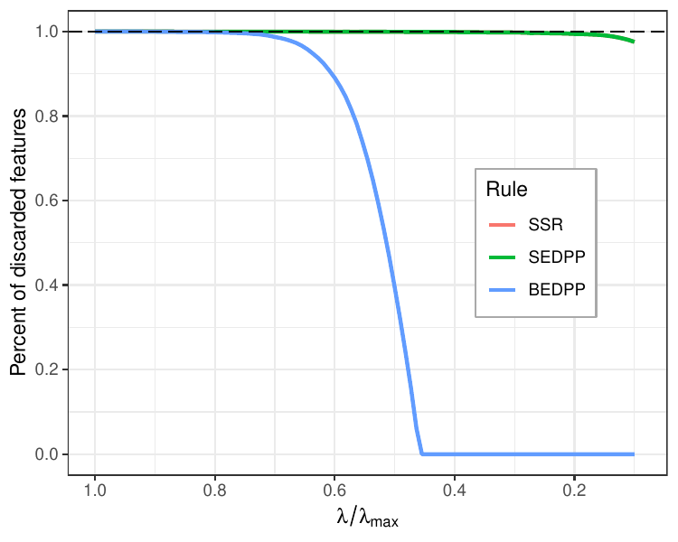
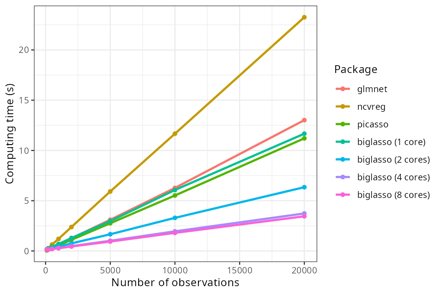
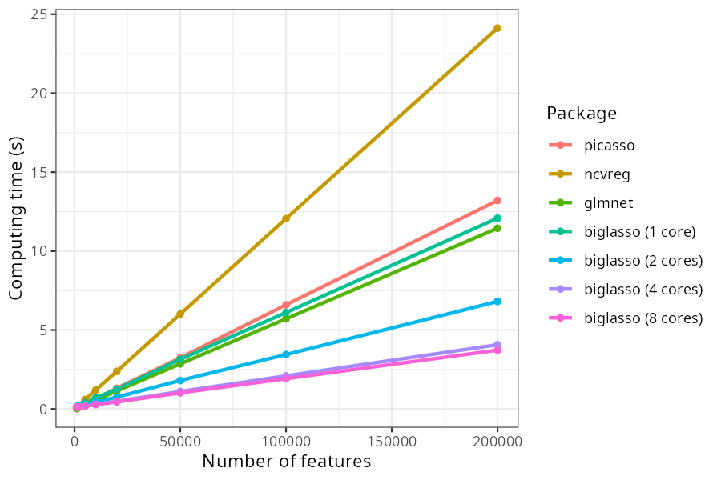
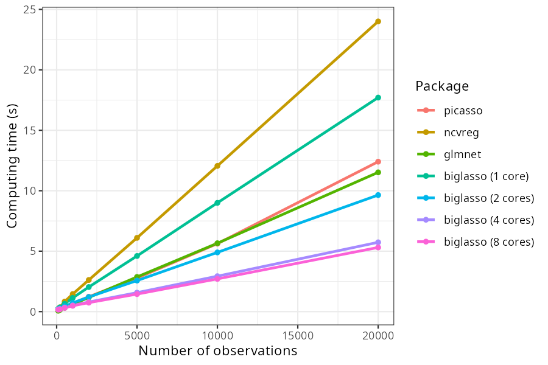
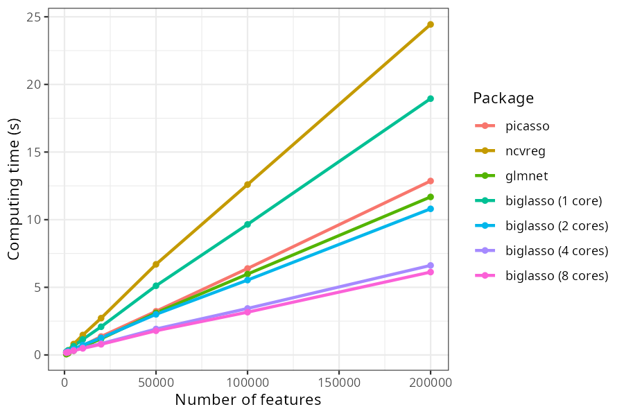
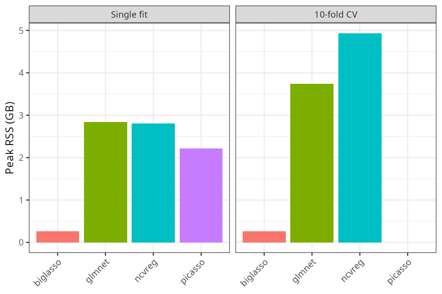
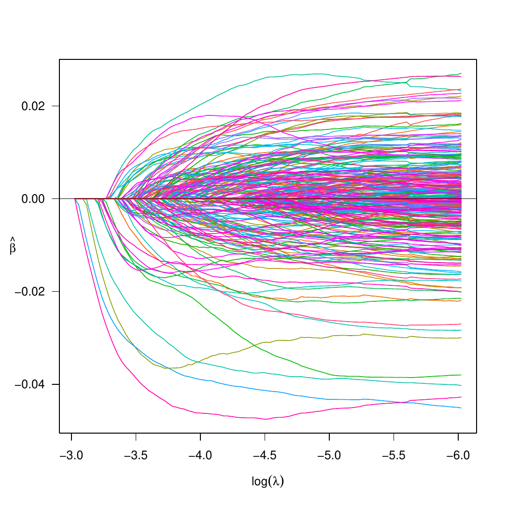
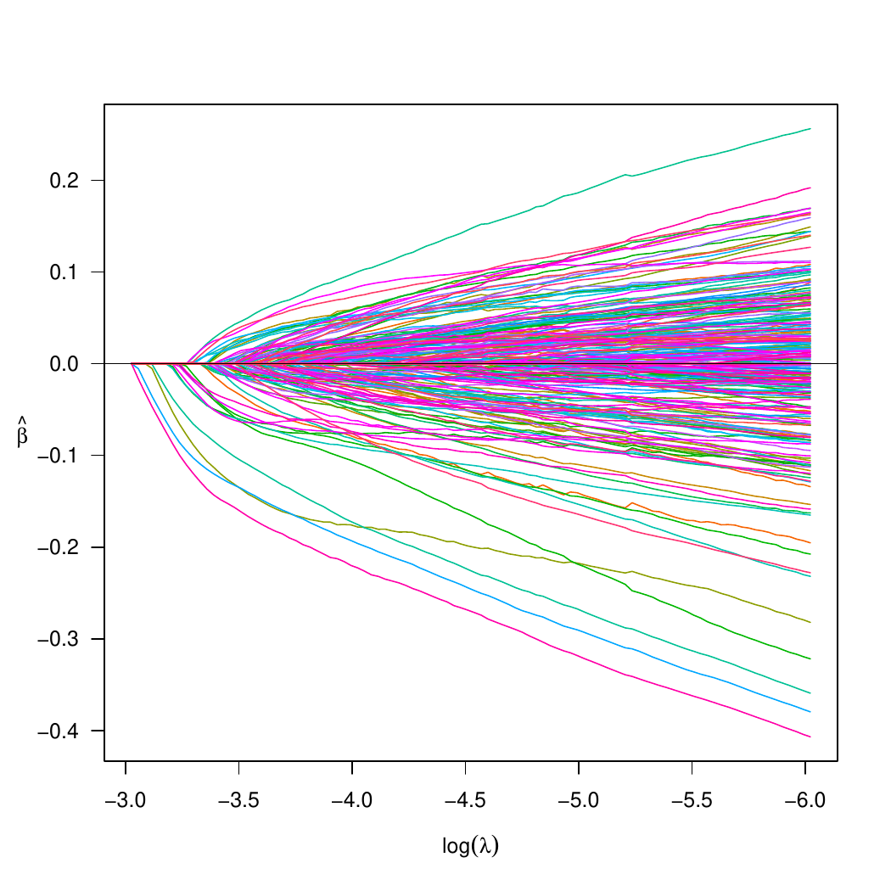
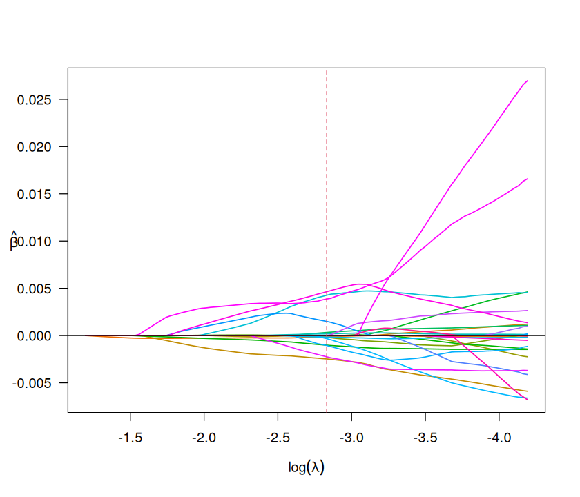
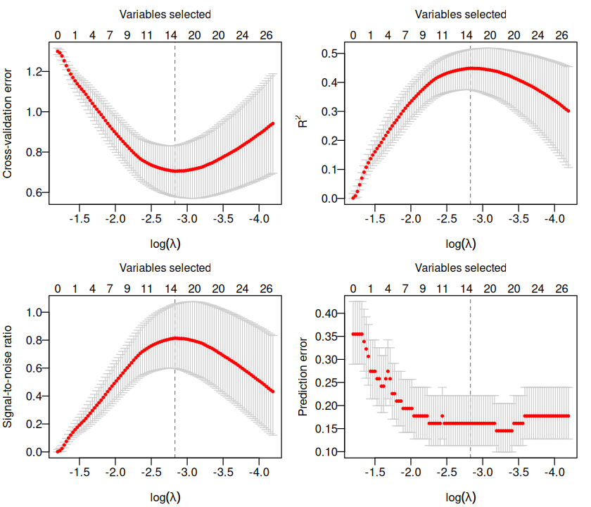

```{r, include = FALSE}
knitr::opts_chunk$set(collapse = TRUE, comment = "#>", fig.align = "center")
bd <- function(f) file.path("benchmarks_data", f)

## Single-threaded vs. best-multicore honesty check for a vary_n/vary_p sweep at its
## largest simulated size - deliberately reports when biglasso (1 core) is *not* the
## fastest option, rather than only ever quoting a "faster" ratio.
sim_note <- function(csv_path) {
  d <- read.csv(csv_path)
  at_max <- d[d$Which.vary == max(d$Which.vary), ]
  bg1 <- at_max$time[at_max$Package == "biglasso (1 core)"]
  bg_best <- at_max[grepl("biglasso", at_max$Package), ]
  bg_best <- bg_best[which.min(bg_best$time), ]
  comp_best <- at_max[!grepl("biglasso", at_max$Package), ]
  comp_best <- comp_best[which.min(comp_best$time), ]
  list(bg1 = bg1, bg_best_pkg = bg_best$Package, bg_best_time = bg_best$time,
       comp_best_pkg = comp_best$Package, comp_best_time = comp_best$time)
}

sim_note_sentence <- function(info) {
  single <- if (info$bg1 <= info$comp_best_time) {
    sprintf("`biglasso` (1 core) is already the fastest package here (%.1fx faster than `%s`)",
            info$comp_best_time / info$bg1, info$comp_best_pkg)
  } else {
    sprintf("`biglasso` (1 core) is *not* the fastest package here - it trails `%s` by a factor of %.1f",
            info$comp_best_pkg, info$bg1 / info$comp_best_time)
  }
  multicore <- sprintf("with multiple cores (`%s`), `biglasso` is the fastest option overall, %.1fx faster than the fastest single-threaded package (`%s`)",
                        info$bg_best_pkg, info$comp_best_time / info$bg_best_time, info$comp_best_pkg)
  sprintf("At the largest simulated size, %s; %s.", single, multicore)
}

## Which package actually won on each real dataset, from a "dataset,method,time.mean,..."
## table - used so the real-data sections state plainly when biglasso does *not* have
## the fastest time, rather than only describing the cases where it does.
real_note_sentence <- function(csv_path, label) {
  d <- read.csv(csv_path)
  fastest <- do.call(rbind, lapply(split(d, d$dataset), function(x) x[which.min(x$time.mean), ]))
  n_ds <- nrow(fastest)
  bg_wins <- sum(fastest$method == "biglasso")
  if (bg_wins == n_ds) {
    return(sprintf("`biglasso` has the fastest mean time on all %d %s data sets tested here.", n_ds, label))
  }
  winners <- fastest$method[fastest$method != "biglasso"]
  win_tbl <- sort(table(winners), decreasing = TRUE)
  winner_txt <- paste(sprintf("`%s` (%d)", names(win_tbl), win_tbl), collapse = ", ")
  lead <- if (bg_wins == 0) {
    sprintf("`biglasso` does not have the fastest mean time on any of the %d %s data sets tested here - %s did.",
            n_ds, label, winner_txt)
  } else {
    sprintf("`biglasso` has the fastest mean time on %d of the %d %s data sets tested here; on the others it is not the fastest by raw computing time - %s was.",
            bg_wins, n_ds, label, winner_txt)
  }
  paste(lead, "`glmnet` in particular has gotten faster since the original biglasso paper was",
        "published, and on real data at these sizes it's often competitive with or faster than",
        "`biglasso`. `biglasso`'s advantage on real data is primarily memory (see below), not",
        "always raw speed.")
}
```

This vignette shows how `biglasso` compares to `glmnet`, `ncvreg`, and `picasso` on
simulated and real data sets, covering linear regression, logistic regression, memory
efficiency, and out-of-core ("bigger than RAM") fitting. All numbers and figures below
are generated by a separate reproducibility archive,
[biglasso-bench](https://github.com/pbreheny/biglasso-bench), and copied in here by
its `workflow/scripts/publish/copy_to_pkgdown.sh` - see that repo if you want to
re-run any of this yourself. The R chunks in each section below are shown for
reference (`eval = FALSE`) rather than actually re-run as part of building this
vignette, since they call out to a Snakemake pipeline in a different repo.

```{r, results = "asis", echo = FALSE}
prov <- readLines(bd("PROVENANCE.md"))
commit <- trimws(sub(".*Source commit:\\s*", "", grep("Source commit", prov, value = TRUE)))
generated <- trimws(sub(".*Generated:\\s*", "", grep("^- Generated:", prov, value = TRUE)))
## backticks (code span) keep pandoc from parsing "...@1fb083f" as a citation key
cat(sprintf("**Source:** `%s`  \n**Generated:** %s\n", commit, generated))
```

## Screening rules

`biglasso`'s adaptive screening rules discard features that provably cannot enter the
model at the current `lambda`, avoiding wasted work scanning the full (possibly huge)
design matrix. The figure below shows what fraction of features each rule discards
across the solution path, on the bcTCGA breast-cancer gene expression data
(the plot's legend uses the rules' old pre-1.5 names, `SSR`/`SEDPP`/`BEDPP` -
current `biglasso` calls these `SSR`, `Adaptive`, and `Hybrid` respectively).

```{r, eval = FALSE}
# from biglasso-bench/:
snakemake screening
```



## Linear regression

### Simulated data

Solving the lasso path (100 `lambda` values, log-spaced from `lambda_max` down to
`0.1 * lambda_max`) over 20 replications, varying the number of observations `n`
(`p` fixed at 10,000) and the number of features `p` (`n` fixed at 1,000). Data are
generated as `y = X %*% beta + 0.1 * eps`, `X` and `eps` iid `N(0, 1)`.

```{r, eval = FALSE}
# from biglasso-bench/:
snakemake all --config scale=full   # includes linear_vary_n, linear_vary_p
```



```{r, results = "asis", echo = FALSE}
cat("- Varying `n`:", sim_note_sentence(sim_note(bd("vary_n_linear.csv"))), "\n")
cat("- Varying `p`:", sim_note_sentence(sim_note(bd("vary_p_linear.csv"))), "\n")
```

### Real data

The same path-fitting benchmark, run on three real data sets: breast-cancer gene
expression data ([bcTCGA](https://iowabiostat.github.io/data-sets/brca1/brca1.html)),
[MNIST](https://github.com/IowaBiostat/data-sets) handwritten digit images, and a
resampled subset of the NYT bag-of-words corpus (see
[biglasso-bench](https://github.com/pbreheny/biglasso-bench)'s README for exact
provenance of each).

```{r, eval = FALSE}
# from biglasso-bench/:
snakemake all --config scale=full   # includes linear_real_{gene,mnist,nyt}
```

```{r, echo = FALSE}
d <- read.csv(bd("linear_real_data.csv"))
d$time <- sprintf("%.2f (%.3f)", d$time.mean, d$time.se)
knitr::kable(
  reshape(d[, c("dataset", "method", "time")], idvar = "method", timevar = "dataset", direction = "wide"),
  col.names = c("Method", unique(d$dataset)),
  row.names = FALSE,
  caption = "Mean (SE) computing time in seconds, 20 replications."
)
```

```{r, results = "asis", echo = FALSE}
cat(real_note_sentence(bd("linear_real_data.csv"), "real linear-regression"))
```

## Logistic regression

### Simulated data

Same design as the linear-regression sweep above, but fitting
`family = "binomial"` models.

```{r, eval = FALSE}
# from biglasso-bench/:
snakemake all --config scale=full   # includes logistic_vary_n, logistic_vary_p
```



```{r, results = "asis", echo = FALSE}
cat("- Varying `n`:", sim_note_sentence(sim_note(bd("vary_n_logistic.csv"))), "\n")
cat("- Varying `p`:", sim_note_sentence(sim_note(bd("vary_p_logistic.csv"))), "\n")
```

### Real data

RCV1 (in the default `all` target) plus Gisette, NEWS20, and P53 (opt-in via
`logistic_real_extra`, kept opt-in purely for download size - 22-191MB each).

```{r, eval = FALSE}
# from biglasso-bench/:
snakemake all logistic_real_extra --config scale=full
```

```{r, echo = FALSE}
d <- read.csv(bd("logistic_real_data.csv"))
d$time <- sprintf("%.2f (%.3f)", d$time.mean, d$time.se)
knitr::kable(
  reshape(d[, c("dataset", "method", "time")], idvar = "method", timevar = "dataset", direction = "wide"),
  col.names = c("Method", unique(d$dataset)),
  row.names = FALSE,
  caption = "Mean (SE) computing time in seconds, 20 replications."
)
```

```{r, results = "asis", echo = FALSE}
cat(real_note_sentence(bd("logistic_real_data.csv"), "real logistic-regression"))
```

## Memory efficiency

`biglasso` never copies `X` into ordinary R memory - it operates on a file-backed
`big.matrix` throughout. To quantify the effect, we simulate a 1,000 x 100,000 design
matrix (raw size 0.75 GB) and measure peak resident set size (RSS) via
`/usr/bin/time -v` for a single fit and for 10-fold cross-validation (`picasso` has no
`cv.*` function, hence no CV bar for it below).

```{r, eval = FALSE}
# from biglasso-bench/:
snakemake memory
```



```{r, echo = FALSE}
d <- read.csv(bd("memory_benchmark.csv"))
d$task <- factor(d$task, levels = c("fit", "cv"), labels = c("Single fit", "10-fold CV"))
knitr::kable(
  reshape(d[, c("package", "task", "max_rss_gb")], idvar = "package", timevar = "task", direction = "wide"),
  col.names = c("Package", "Single fit (GB)", "10-fold CV (GB)"),
  digits = 2,
  row.names = FALSE
)
```

## Out-of-core computation

To demonstrate fitting data larger than available RAM, we simulate an
`r {d <- read.csv(bd("bigdata_summary.csv")); paste0("n = ", d$n[1], ", p = ", format(d$p[1], big.mark = ","))}`
design matrix (tens of GB on disk) and fit both linear and logistic lasso models
using `biglasso`'s `"Hybrid"` screening rule, entirely off a memory-mapped file.

```{r, eval = FALSE}
# from biglasso-bench/:
snakemake bigdata
```



## Colon cancer worked example

The `biglasso` intro vignette's small-data colon-cancer demo (`data(colon)`), fit and
cross-validated end to end as a sanity check that the whole pipeline - not just the
large-scale benchmarks above - reproduces the package's documented behavior.

```{r, eval = FALSE}
# from biglasso-bench/:
snakemake all --config scale=full   # example_colon_cancer
```



## Reproducing these results

All of the above comes from [biglasso-bench](https://github.com/pbreheny/biglasso-bench),
a Snakemake-driven pipeline that is entirely separate from this package:

```sh
git clone https://github.com/pbreheny/biglasso-bench
cd biglasso-bench
snakemake all memory bigdata logistic_real_extra --config scale=full --cores 1
snakemake publish --config scale=full
BIGLASSO_REPO=/path/to/biglasso workflow/scripts/publish/copy_to_pkgdown.sh
```

The last two commands regenerate the figures/tables under `vignettes/figures/` and
`vignettes/benchmarks_data/` in *this* repo from whatever the latest `biglasso-bench`
run produced, and are safe to re-run any time you want this
vignette's numbers refreshed (e.g. after a `biglasso` performance change) - review
the resulting `git diff` here before committing.
